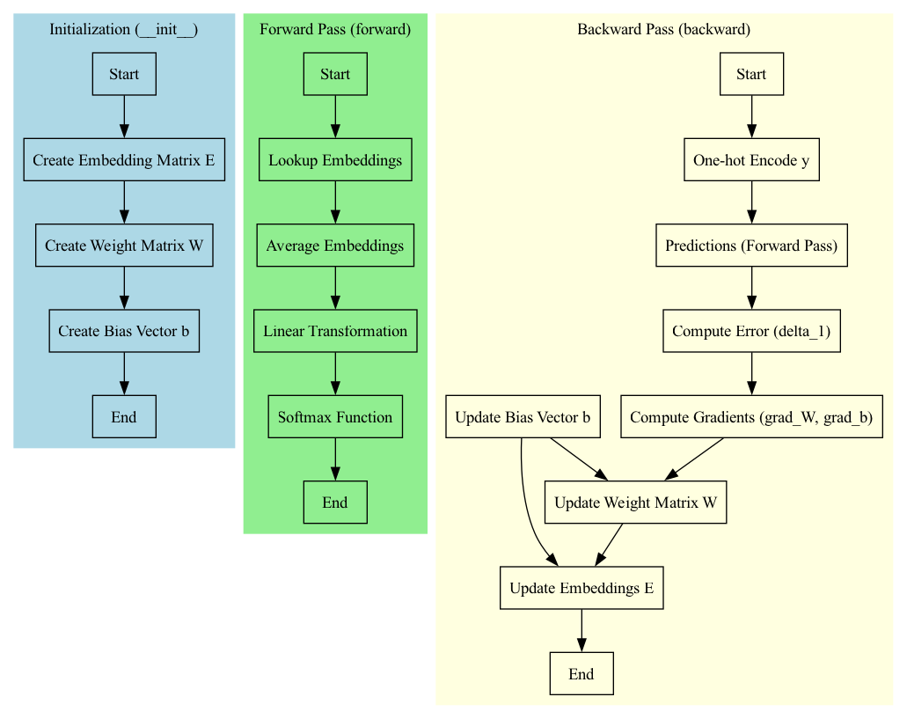
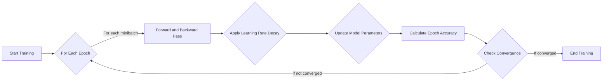

# Report on Continuous Bag of Words (CBOW) Classifier Implementation and Training

## The CBOW Model

### Forward Pass

The `forward` method calculates the predictions. It averages the word embeddings for each context and applies a linear transformation followed by a softmax function to produce a probability distribution over the vocabulary.

Mathematically, this can be represented as:

$$
\text{softmax}(\overline{E[X]}W + b)
$$

Here, `E[X]` denotes the embedding lookup and `overline{E[X]}` represents the average embedding for the context words.

### Backward Pass

In the `backward` method, the model updates its parameters based on the error between its predictions and the actual labels.

The gradients for updating the weights (`W`) and biases (`b`) are calculated as follows:

$$
W := W - \frac{\eta}{B} \cdot ({E[X]}^T \delta_1)\\
b := b - \frac{\eta}{B} \cdot 1^T \delta_1
$$

Where `delta_1` is the error from the softmax output, `η` is the learning rate, and `B` is the batch size.

## Training Procedure

The `train` function is where the model learns from the data. It initializes the `CBOW` model and updates its parameters over several training epochs.

### Minibatches

We use the concept of minibatches, which means updating the model parameters after processing a small subset of the data rather than the entire dataset at once. 

### Learning Rate Decay

A learning rate decay strategy is employed to reduce the learning rate by a certain percentage after each epoch. 

### Regularization

L2 regularization is applied to the model's parameter updates to mitigate overfitting, where a model learns the training data too closely and fails to generalize well to unseen data.

## Conclusion

After the implementation of these components and training the model, we observed an improvement in accuracy from 23% to 34%(epoch = 20), 36%(epoch = 30). While this is a significant increase, further improvements are necessary to achieve higher target accuracy.
